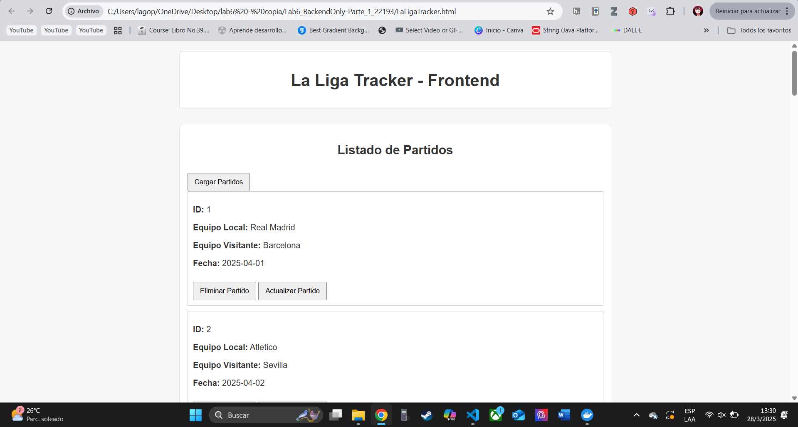
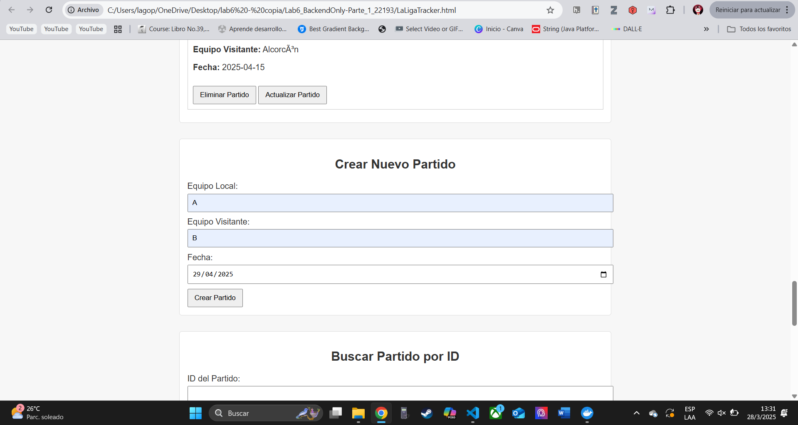
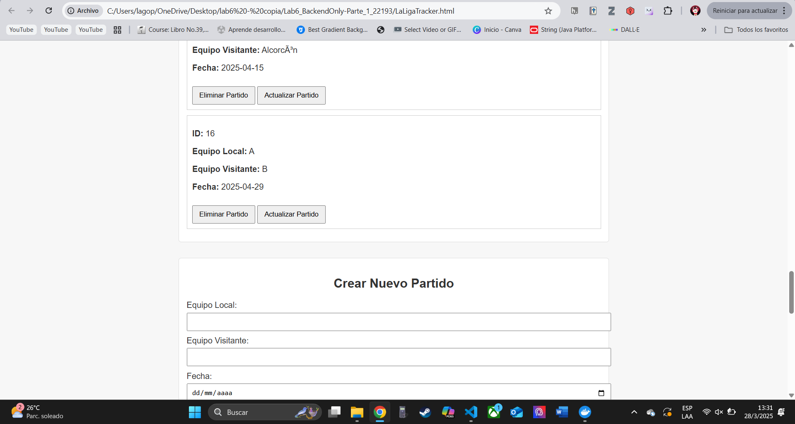
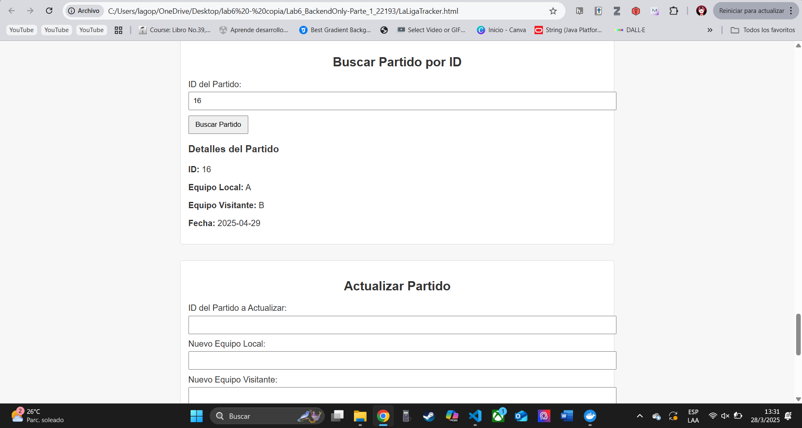
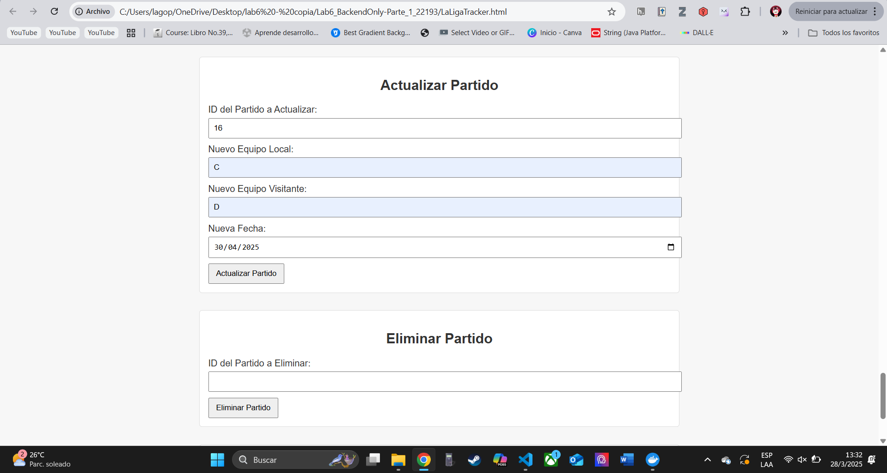
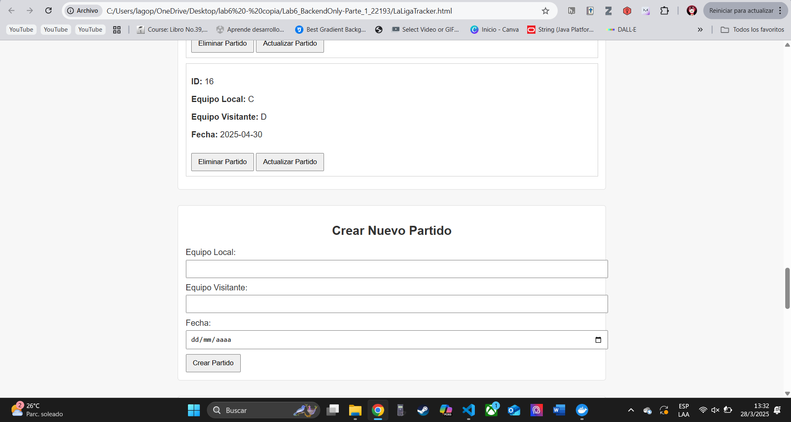
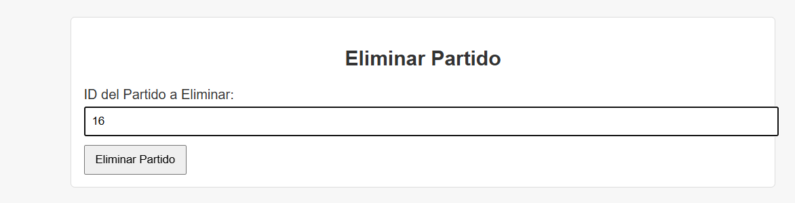
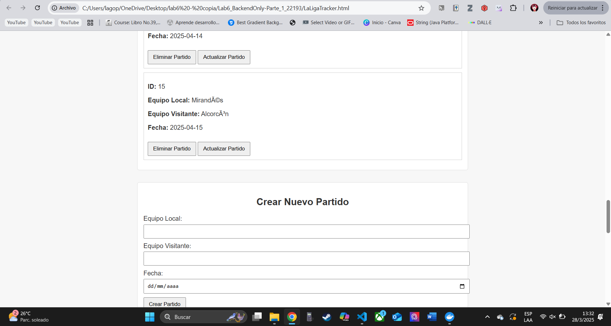
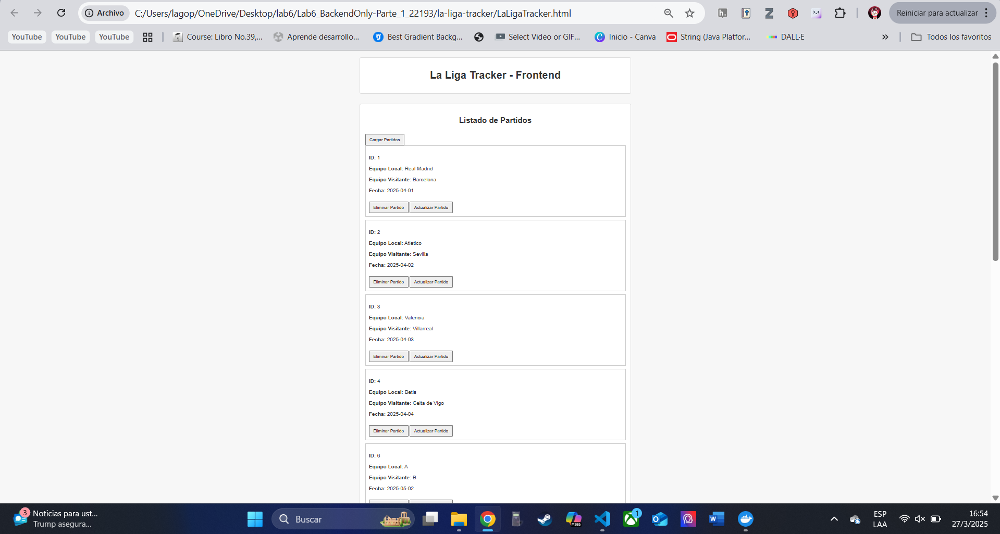
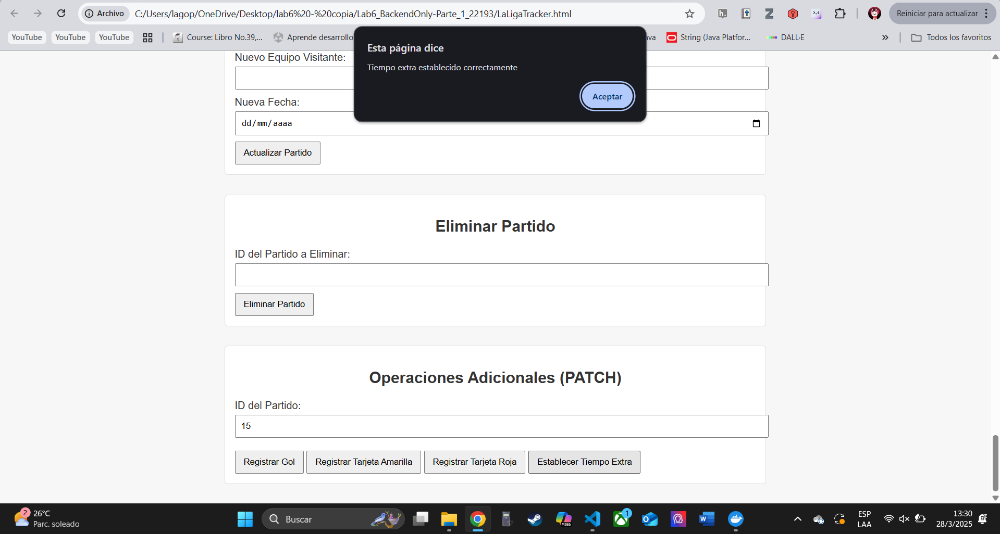

# ⚽ La Liga Tracker - Backend

Este proyecto implementa el backend de la aplicación web **La Liga Tracker**, desarrollado en **Go** con conexión a base de datos **MySQL**, desplegado con **Docker Compose**. Permite gestionar partidos de fútbol de La Liga mediante una **API RESTful** con soporte para operaciones básicas y actualizaciones específicas como goles, tarjetas y tiempo extra.

---

## 📦 Funcionalidad RESTful

| Método  | Endpoint                         | Descripción                                     |
|---------|----------------------------------|-------------------------------------------------|
| GET     | `/api/matches`                  | Obtener todos los partidos                      |
| GET     | `/api/matches/:id`              | Obtener un partido por su ID                    |
| POST    | `/api/matches`                  | Crear un nuevo partido                          |
| PUT     | `/api/matches/:id`              | Actualizar un partido existente                 |
| DELETE  | `/api/matches/:id`              | Eliminar un partido por su ID                   |
| PATCH   | `/api/matches/:id/goals`        | Registrar un gol en el partido                  |
| PATCH   | `/api/matches/:id/yellowcards`  | Registrar una tarjeta amarilla                  |
| PATCH   | `/api/matches/:id/redcards`     | Registrar una tarjeta roja                      |
| PATCH   | `/api/matches/:id/extratime`    | Registrar o modificar el tiempo extra del juego |

---

## 🐳 Uso con Docker y Docker Compose

### 📁 Estructura del proyecto

```bash
├── main.go               # Código fuente del backend en Go
├── Dockerfile            # Imagen del backend (puerto 8080)
├── docker-compose.yml    # Orquestador de servicios (MySQL + Backend)
├── init.sql              # Script para inicializar tabla en MySQL
├── LaLigaTracker.html    # Frontend proporcionado
├── swagger.yaml          # Documentación Swagger del API
├── llms.txt              # Explicación del uso de la API
├── screenshots.png       # Capturas del frontend funcionando
├── go.mod / go.sum       # Dependencias del proyecto
└── README.md             # Este documento
```

### ▶️ Cómo ejecutar el proyecto

```bash
# 1. Construir y levantar los servicios (backend y base de datos)
docker compose up --build

# 2. Backend disponible en:
http://localhost:8080

# 3. Abrir el frontend (HTML local en navegador con Live Server o similar)
http://localhost:5500/LaLigaTracker.html
```

---

## 🧪 Colección de pruebas

Una colección de pruebas ya está disponible en Postman para verificar todos los endpoints implementados:

- 🔗 [Postman Collection - La Liga Tracker](https://danielbarillas.postman.co/workspace/Daniel-Barillas's-Workspace~9102d261-b50b-49a8-8c55-1271f1db1d04/collection/43570440-52531523-664e-4266-8969-33c5665dfd42)

> También se puede importar los endpoints manualmente o desde el archivo `swagger.yaml`.

---

## 📄 Documentación de la API

El archivo [`swagger.yaml`](swagger.yaml) documenta todos los endpoints de la API, incluyendo descripciones, métodos HTTP y parámetros. Puedes visualizarlo con:

- Swagger Editor: https://editor.swagger.io/
- Hoppscotch: https://hoppscotch.io
- Postman: Importación directa desde YAML

---

## 📃 Archivo llms.txt

El archivo `llms.txt` explica el uso de la API: cómo se estructura, qué operaciones están disponibles y cómo consumirla desde herramientas externas como Postman, Hoppscotch o mediante código personalizado.

---

## 🔧 Detalles técnicos

- Lenguaje: **Go**
- Base de Datos: **MySQL 8.0**
- Driver MySQL: `github.com/go-sql-driver/mysql`
- Puerto de Backend: `8080`
- La API maneja automáticamente **CORS**
- La conexión a MySQL tiene reintento automático en caso de fallo
- Todos los datos se guardan de forma persistente usando el script `init.sql`

---

## 📸 Capturas del Frontend funcionando






















---

## 👨‍💻 Autor

- **Nombre:** Pablo Daniel Barillas Moreno  
- **Carné:** 22193

---